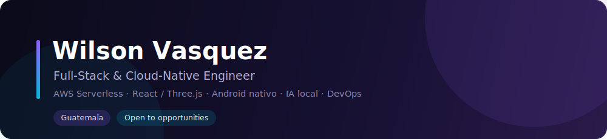

  

  <a href="README.md">English</a> &nbsp;·&nbsp; <b>Español</b>

  Construyo sistemas full-stack y cloud-native de principio a fin — desde un frontend en
  React/Three.js hasta un backend serverless en AWS, apps Android nativas e IA local con
  enfoque en privacidad. Priorizo arquitectura limpia, infraestructura como código, pruebas
  automatizadas y un alcance honesto.

  
  
  
  

---

## Highlights

- **Full-stack, cloud-native** — SPA en React 18 + Vite + Three.js con una API serverless en AWS (Lambda, API Gateway, DynamoDB).
- **Infraestructura como código y CI/CD seguro** — módulos de Terraform + GitHub Actions con **OIDC (sin claves estáticas de AWS)**.
- **Android nativo** — apps offline-first en Kotlin y Jetpack Compose con almacenamiento local cifrado.
- **IA local-first** — un asistente para Windows que ejecuta modelos localmente con Ollama, sin APIs de IA en la nube.
- **Disciplina de ingeniería** — logs estructurados, alarmas de CloudWatch, **246 pruebas de backend** y documentación como parte del producto.

---

## Proyectos destacados

### ☁️ Portafolio Cloud-Native + Mini ERP/CRM Lite
Portafolio 3D en React/Three.js con un **Mini ERP/CRM serverless** integrado (autenticación por roles, requisiciones, inventario, pipeline de CRM, reportes) como caso de estudio full-stack — S3 + CloudFront, Lambda, DynamoDB, Terraform y CI/CD.

`React` · `Vite` · `Three.js` · `AWS Lambda` · `DynamoDB` · `Terraform`

[**Demo en vivo**](https://dxxrwydm6m8sc.cloudfront.net) · [**Código**](https://github.com/lighsiegfried/portafolio)

### 📱 Mis Finanzas — Android local-first
App Android nativa de finanzas personales: **offline-first**, almacenamiento cifrado en el dispositivo, Clean Architecture + MVVM, respaldos cifrados portables y un asistente local de solo lectura. Sin sincronización en la nube.

`Kotlin` · `Jetpack Compose` · `Room` · `SQLCipher` · `Android`

[**Código**](https://github.com/lighsiegfried/Finanzas)

### 🤖 agent-automaton — asistente de IA local (Fifi)
Asistente por voz/texto para Windows que planifica con un **LLM local (Ollama)** pero nunca deja actuar al modelo directamente — cada acción pasa por una capa central de seguridad, las sensibles requieren confirmación y las destructivas permanecen bloqueadas.

`Python` · `FastAPI` · `Ollama` · `SQLite` · `Windows`

[**Código**](https://github.com/lighsiegfried/agent-automaton)

---

## Stack técnico

**Frontend**
 

**Backend**
 

**Mobile**
 

**Bases de datos**
 

**Cloud y DevOps**
 

**IA y automatización**
 

---

## Actividad de desarrollo

  
  

Las tarjetas usan un tema transparente, por lo que se adaptan al modo claro y oscuro de GitHub.

---

## Cómo trabajo

- **Arquitectura primero** — separación clara de responsabilidades (Clean Architecture / MVVM, abstracción de repositorios, router propio en Lambda); la lógica de negocio nunca vive en la UI.
- **Infraestructura como código** — entornos reproducibles con Terraform; nada configurado a mano en la consola.
- **Pruebas y fiabilidad** — pruebas automatizadas de rutas de rechazo y de fallo, escrituras atómicas para proteger la integridad de datos, logs estructurados y alarmas de CloudWatch.
- **CI/CD seguro** — GitHub Actions con OIDC (sin claves de nube de larga duración) y smoke tests contra producción.
- **Local-first y privacidad** — almacenamiento cifrado en el dispositivo y ejecución local de modelos cuando el caso lo amerita; sin dependencias innecesarias de la nube.
- **Documentación como entregable** — READMEs, diagramas y notas de decisión para que el trabajo pueda entenderse y auditarse.

---

## Contacto

  
  

